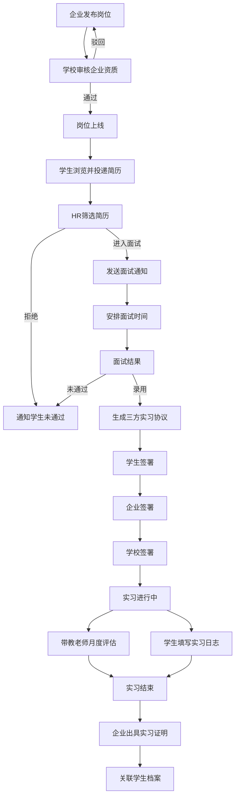

## 1. 产品概述

大学生实习岗位发布与管理平台，连接企业、学生和高校三方，实现从岗位发布、资质审核、简历投递、面试安排、在线签约到实习评估的全流程数字化管理，提升校企合作效率与实习管理透明度。

- 解决传统实习招聘信息分散、流程不透明、签约繁琐、评估缺失等痛点
- 面向高校就业服务中心、企业HR、在校大学生、带教老师四类核心用户

## 2. 核心功能

### 2.1 用户角色

| 角色 | 注册方式 | 核心权限 |
|------|----------|----------|
| 企业HR | 企业邮箱注册+营业执照认证 | 发布岗位、审核简历、安排面试、签署协议、评估学生 |
| 企业带教老师 | HR邀请注册 | 填写月度表现评估 |
| 学生 | 学号注册+学校验证 | 浏览岗位、投递简历、签署协议、填写实习日志 |
| 学校就业指导老师 | 工号注册+管理员审核 | 审核企业资质、查看数据看板、签署协议 |
| 学校管理员 | 系统分配 | 管理学校账号、审核就业指导老师 |

### 2.2 功能模块

1. **首页/岗位大厅**: 岗位搜索与筛选、推荐岗位、平台数据概览
2. **岗位发布与管理页**: 企业发布岗位、编辑岗位、管理岗位状态
3. **企业资质审核页**: 学校审核企业提交的资质材料
4. **简历投递页**: 学生投递简历、填写自我介绍
5. **简历筛选后台**: HR查看投递列表、标记状态（待筛选/进入面试/已拒绝）
6. **面试通知与安排页**: 发送面试通知、安排时间地点
7. **实习协议页**: 三方在线签署实习协议
8. **实习评估页**: 带教老师填写月度表现评估
9. **实习日志页**: 学生填写每日/每周实习日志
10. **实习证明页**: 企业出具实习证明
11. **数据看板页**: 学校查看实习去向分布、录用率、满意度

### 2.3 页面详情

| 页面名称 | 模块名称 | 功能描述 |
|----------|----------|----------|
| 首页/岗位大厅 | Hero横幅 | 展示平台标语、搜索框、统计数据 |
| 首页/岗位大厅 | 岗位列表 | 卡片式展示岗位，支持按专业/周期/薪酬/城市筛选 |
| 首页/岗位大厅 | 推荐岗位 | 根据学生专业推荐匹配岗位 |
| 岗位发布与管理 | 发布表单 | 填写岗位名称、描述、部门、周期、薪酬、专业要求 |
| 岗位发布与管理 | 岗位列表 | 企业已发布岗位的状态管理（草稿/待审核/已上线/已下线） |
| 企业资质审核 | 审核列表 | 展示待审核企业列表，含企业名称、提交时间 |
| 企业资质审核 | 审核详情 | 查看营业执照、企业介绍，通过/驳回操作 |
| 简历投递 | 岗位详情 | 展示岗位完整信息、企业信息 |
| 简历投递 | 投递表单 | 上传简历附件、填写自我介绍 |
| 简历筛选后台 | 投递列表 | 按岗位查看收到的简历，标记筛选状态 |
| 简历筛选后台 | 简历详情 | 查看学生简历、自我介绍、专业背景 |
| 面试通知与安排 | 通知发送 | 选择候选人、填写面试时间地点、发送通知 |
| 面试通知与安排 | 通知记录 | 已发送通知列表、候选人确认状态 |
| 实习协议 | 协议生成 | 录用后自动生成三方协议文档 |
| 实习协议 | 在线签署 | 三方分别确认签署，显示签署进度 |
| 实习评估 | 月度评估表 | 带教老师填写工作态度、专业能力、团队协作等评分 |
| 实习评估 | 评估历史 | 查看历月评估记录 |
| 实习日志 | 日志编辑 | 学生填写实习日志（日期、内容、收获） |
| 实习日志 | 日志列表 | 按时间线查看所有日志 |
| 实习证明 | 证明生成 | 企业填写评语后生成实习证明 |
| 实习证明 | 证明查看 | 学生查看/下载实习证明 |
| 数据看板 | 实习去向分布 | 各专业学生实习企业/行业分布图表 |
| 数据看板 | 企业录用率 | 各企业投递数、面试数、录用数、录用率 |
| 数据看板 | 满意度评价 | 学生对企业评分、企业对学生评分统计 |

## 3. 核心流程

### 3.1 岗位发布与审核流程
企业HR登录后发布实习岗位，填写岗位描述、所在部门、实习周期、薪酬、专业要求等信息。岗位提交后进入待审核状态，学校就业指导老师审核企业资质（营业执照、企业规模等），审核通过后岗位正式上线。

### 3.2 学生投递与面试流程
学生浏览岗位大厅，筛选心仪岗位后投递简历并附上自我介绍。企业HR在后台查看投递列表，筛选简历后标记进入面试的候选人，系统自动向候选人发送面试通知（含时间地点），学生确认参加。

### 3.3 签约与实习管理流程
面试通过后企业确认录用，系统自动生成三方实习协议（学生/企业/学校），三方在线签署。实习期间，带教老师每月填写学生表现评估，学生同步填写实习日志。实习结束后企业出具实习证明，系统自动关联学生档案。

## 4. 用户界面设计

### 4.1 设计风格
- 主色调：深青色(#0F766E) + 琥珀色(#D97706)点缀，传递专业可靠且充满活力的品牌感
- 辅助色：石板灰(#475569)用于正文，白色/浅灰背景分层
- 按钮风格：圆角(8px)，主按钮深青色实心，次按钮描边，危险操作红色
- 字体：标题使用 Noto Serif SC，正文使用 Noto Sans SC，数值/数据使用 DM Sans
- 布局风格：左侧导航栏 + 右侧内容区，卡片式内容组织，表格数据页使用紧凑布局
- 图标风格：线条型图标（Lucide Icons），与整体简洁风格一致

### 4.2 页面设计概览

| 页面名称 | 模块名称 | UI元素 |
|----------|----------|--------|
| 首页/岗位大厅 | Hero横幅 | 深青色渐变背景，白色大标题，搜索框居中，下方3个统计数字卡片动画递增 |
| 首页/岗位大厅 | 岗位列表 | 白色卡片网格(3列)，卡片含企业logo、岗位名、标签(专业/周期/薪酬)，hover微上浮+阴影 |
| 首页/岗位大厅 | 筛选侧栏 | 左侧固定侧栏，多选专业、薪酬范围滑块、周期选择、城市下拉 |
| 岗位发布与管理 | 发布表单 | 居中宽表单，分步骤(基本信息/详细描述/要求设置)，顶部进度条 |
| 岗位发布与管理 | 岗位列表 | 表格布局，状态列使用彩色标签(草稿灰/待审核橙/已上线绿/已下线红) |
| 企业资质审核 | 审核列表 | 卡片列表，左侧企业头像，右侧展示关键信息，底部通过/驳回按钮 |
| 简历投递 | 岗位详情 | 顶部岗位标题区，左侧岗位信息，右侧企业信息卡片，底部投递按钮 |
| 简历投递 | 投递表单 | 模态框弹出，简历拖拽上传区+自我介绍文本域 |
| 简历筛选后台 | 投递列表 | 表格布局，每行可展开查看简历详情，状态筛选标签页 |
| 面试通知与安排 | 通知表单 | 模态框，日期时间选择器+地点输入+备注文本域 |
| 实习协议 | 签署页面 | 协议文档预览区(模拟A4纸)，右侧签署进度面板(三方签署状态) |
| 实习评估 | 评估表单 | 评分维度以星级+文字评价，整体表单卡片式布局 |
| 实习日志 | 日志编辑 | 简洁编辑器，日期选择+富文本输入，左侧时间线导航 |
| 实习证明 | 证明页面 | 模拟证书样式(金色边框+校徽+企业章)，下载按钮 |
| 数据看板 | 图表区域 | 柱状图(去向分布)、折线图(录用率趋势)、雷达图(满意度维度)，深色卡片背景 |

### 4.3 响应式设计
- 桌面优先设计，主要内容区最大宽度1280px
- 平板端导航栏折叠为汉堡菜单，卡片网格从3列变2列
- 移动端单列布局，表格转为卡片列表，筛选条件折叠

### 4.4 无3D场景
