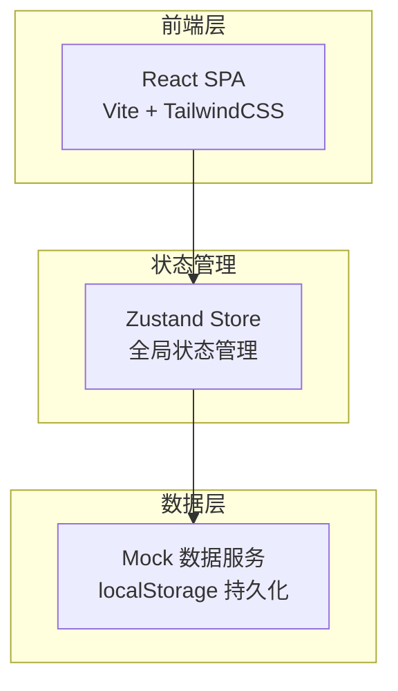
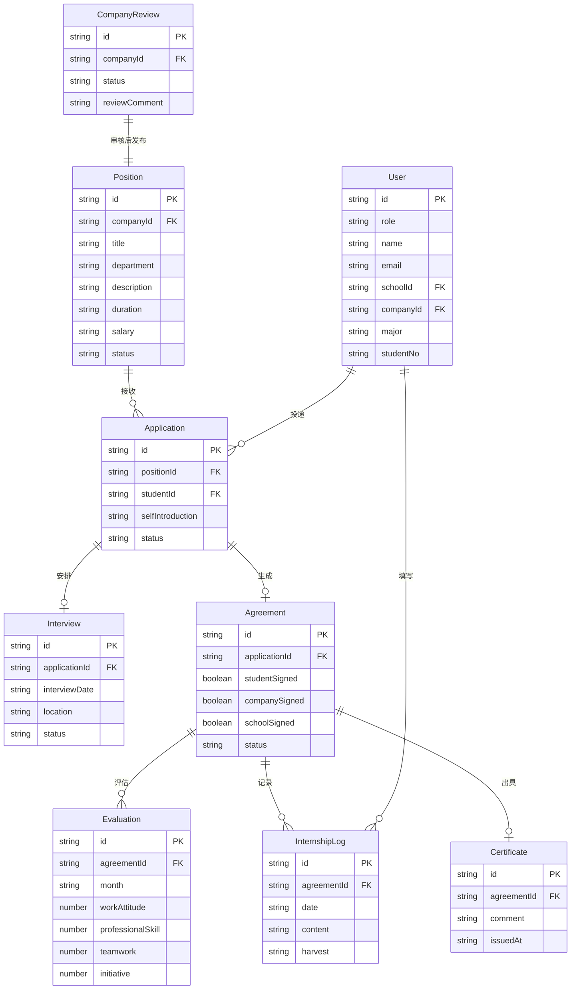

## 1. 架构设计



## 2. 技术说明

- 前端：React@18 + TailwindCSS@3 + Vite
- 初始化工具：Vite (npm create vite@latest)
- 后端：无（使用 Mock 数据 + localStorage 模拟持久化）
- 数据库：无（前端 Mock 数据）
- 状态管理：Zustand
- 路由：React Router v6
- 图表：Recharts
- 图标：Lucide React
- 日期处理：date-fns
- 表单：React Hook Form + Zod 验证
- 文档预览：自定义组件模拟

## 3. 路由定义

| 路由 | 用途 |
|------|------|
| / | 首页/岗位大厅 |
| /position/:id | 岗位详情与投递 |
| /company/post | 企业发布岗位 |
| /company/positions | 企业岗位管理 |
| /company/applications | 企业简历筛选后台 |
| /company/interviews | 面试通知与安排 |
| /company/agreements | 企业协议管理 |
| /company/evaluations | 带教老师评估 |
| /company/certificates | 实习证明出具 |
| /student/applications | 学生投递记录 |
| /student/logs | 学生实习日志 |
| /student/agreements | 学生协议签署 |
| /student/certificates | 学生实习证明 |
| /school/reviews | 学校资质审核 |
| /school/dashboard | 数据看板 |
| /school/agreements | 学校协议签署 |
| /login | 登录页 |
| /register | 注册页 |

## 4. API 定义（Mock）

### 4.1 用户相关

```typescript
interface User {
  id: string;
  role: 'student' | 'company_hr' | 'company_mentor' | 'school_teacher' | 'school_admin';
  name: string;
  email: string;
  avatar?: string;
  schoolId?: string;
  companyId?: string;
  major?: string;
  studentNo?: string;
}

interface LoginRequest {
  email: string;
  password: string;
  role: User['role'];
}

interface LoginResponse {
  user: User;
  token: string;
}
```

### 4.2 岗位相关

```typescript
interface Position {
  id: string;
  companyId: string;
  companyName: string;
  companyLogo: string;
  title: string;
  department: string;
  description: string;
  duration: string;
  salary: string;
  requirements: string[];
  majorRequired: string[];
  city: string;
  status: 'draft' | 'pending_review' | 'approved' | 'rejected' | 'offline';
  createdAt: string;
  updatedAt: string;
}

interface PositionFormData {
  title: string;
  department: string;
  description: string;
  duration: string;
  salary: string;
  requirements: string[];
  majorRequired: string[];
  city: string;
}
```

### 4.3 投递相关

```typescript
interface Application {
  id: string;
  positionId: string;
  studentId: string;
  studentName: string;
  studentMajor: string;
  resumeUrl: string;
  selfIntroduction: string;
  status: 'pending' | 'screened' | 'interview' | 'rejected' | 'offered' | 'accepted';
  createdAt: string;
  updatedAt: string;
}
```

### 4.4 面试相关

```typescript
interface Interview {
  id: string;
  applicationId: string;
  positionId: string;
  studentId: string;
  studentName: string;
  companyName: string;
  positionTitle: string;
  interviewDate: string;
  interviewTime: string;
  location: string;
  note?: string;
  status: 'pending' | 'confirmed' | 'completed' | 'cancelled';
}
```

### 4.5 协议相关

```typescript
interface Agreement {
  id: string;
  applicationId: string;
  positionId: string;
  studentId: string;
  studentName: string;
  companyId: string;
  companyName: string;
  schoolId: string;
  schoolName: string;
  startDate: string;
  endDate: string;
  studentSigned: boolean;
  companySigned: boolean;
  schoolSigned: boolean;
  studentSignDate?: string;
  companySignDate?: string;
  schoolSignDate?: string;
  status: 'pending_student' | 'pending_company' | 'pending_school' | 'completed';
}
```

### 4.6 评估相关

```typescript
interface Evaluation {
  id: string;
  agreementId: string;
  studentId: string;
  studentName: string;
  mentorId: string;
  mentorName: string;
  month: string;
  workAttitude: number;
  professionalSkill: number;
  teamwork: number;
  initiative: number;
  overallScore: number;
  comment: string;
  createdAt: string;
}
```

### 4.7 实习日志

```typescript
interface InternshipLog {
  id: string;
  agreementId: string;
  studentId: string;
  date: string;
  content: string;
  harvest: string;
  createdAt: string;
}
```

### 4.8 实习证明

```typescript
interface Certificate {
  id: string;
  agreementId: string;
  studentId: string;
  studentName: string;
  companyId: string;
  companyName: string;
  positionTitle: string;
  startDate: string;
  endDate: string;
  comment: string;
  issuedAt: string;
}
```

### 4.9 企业资质审核

```typescript
interface CompanyReview {
  id: string;
  companyId: string;
  companyName: string;
  businessLicense: string;
  companyIntro: string;
  companyScale: string;
  industry: string;
  status: 'pending' | 'approved' | 'rejected';
  reviewerId?: string;
  reviewerName?: string;
  reviewComment?: string;
  reviewedAt?: string;
  submittedAt: string;
}
```

## 5. 服务器架构图

无后端服务器，使用前端 Mock 数据 + localStorage 模拟。

## 6. 数据模型

### 6.1 数据模型定义



### 6.2 数据定义语言

前端 Mock 数据，使用 TypeScript 接口定义 + 初始种子数据存储于 `src/data/mockData.ts`。
